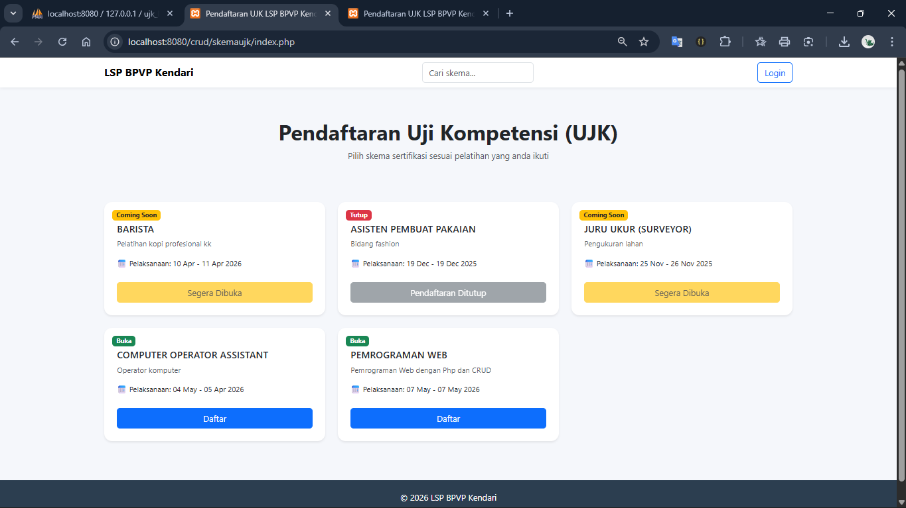
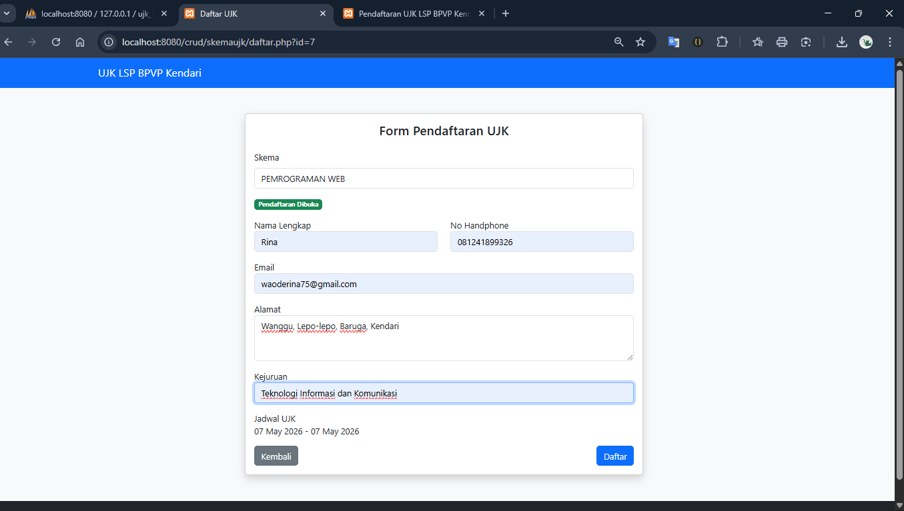
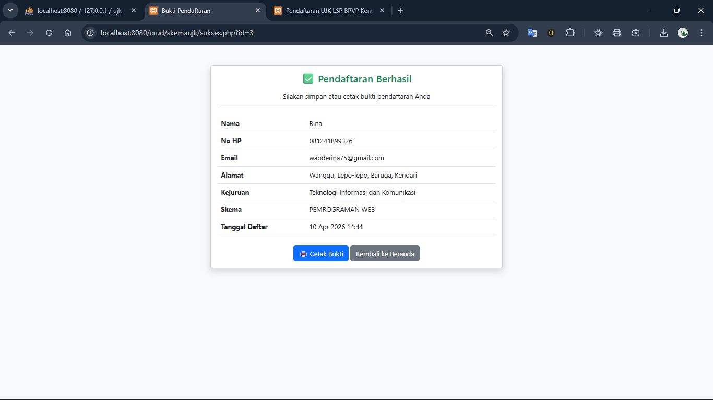
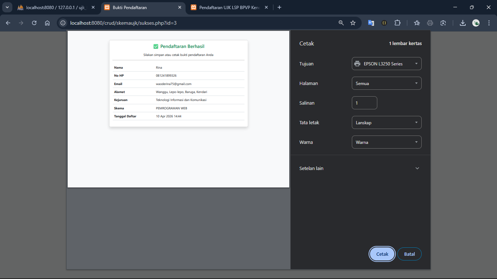
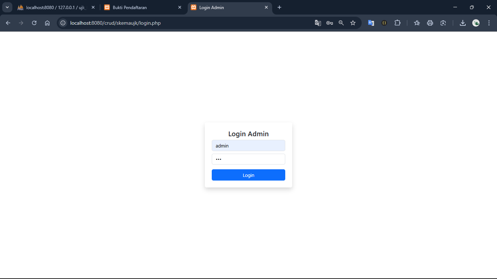
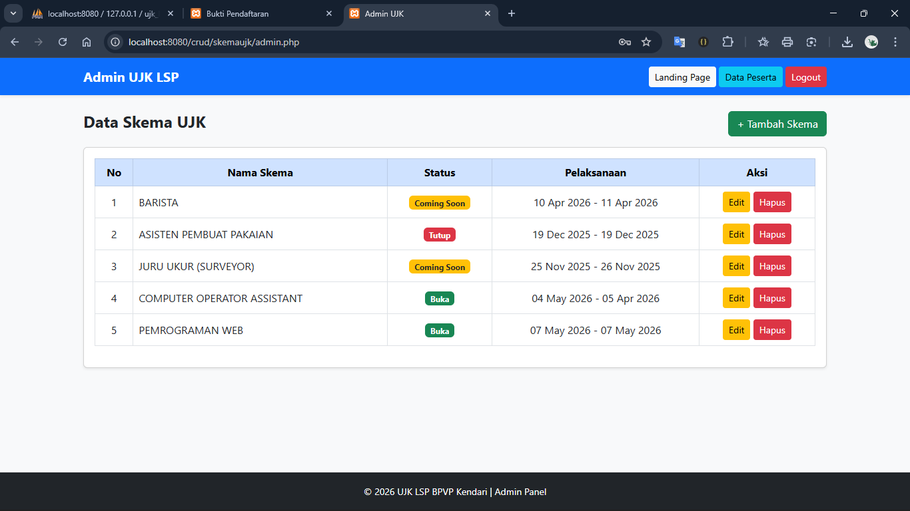
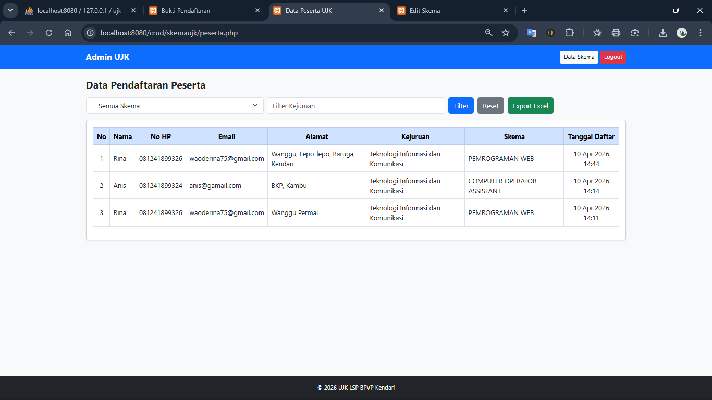
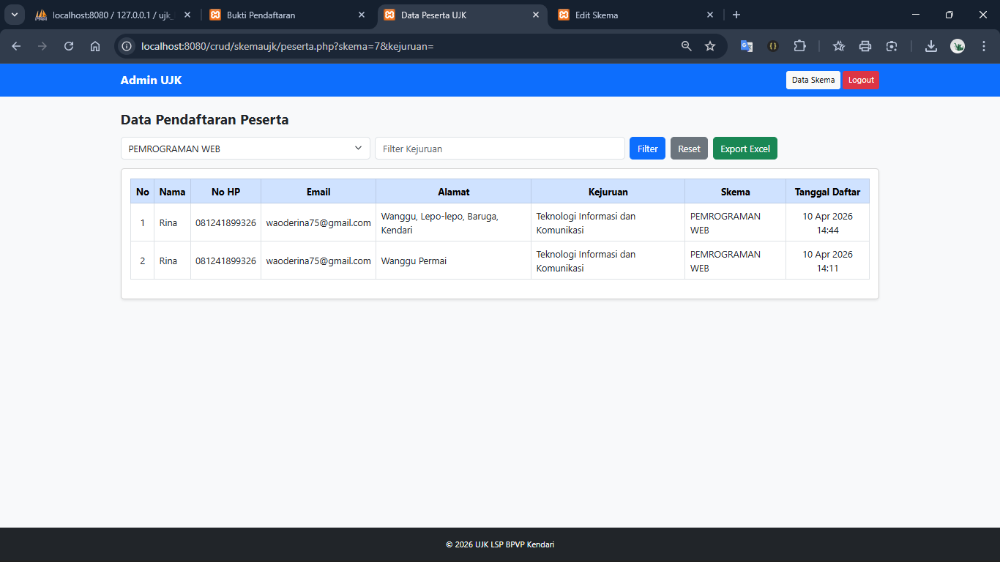
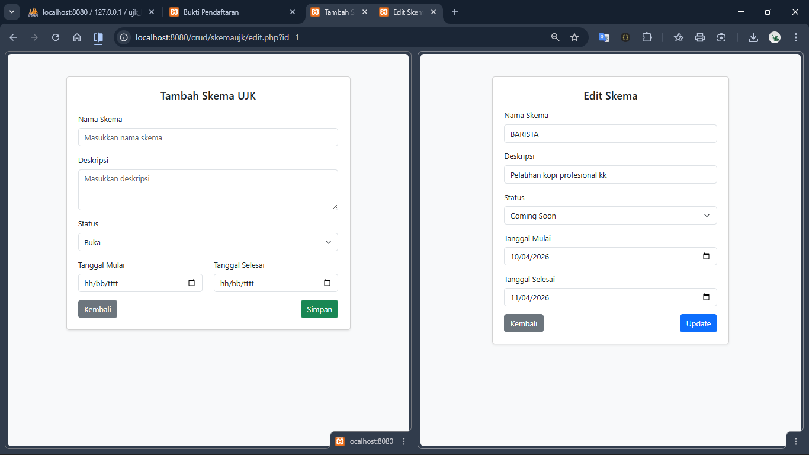
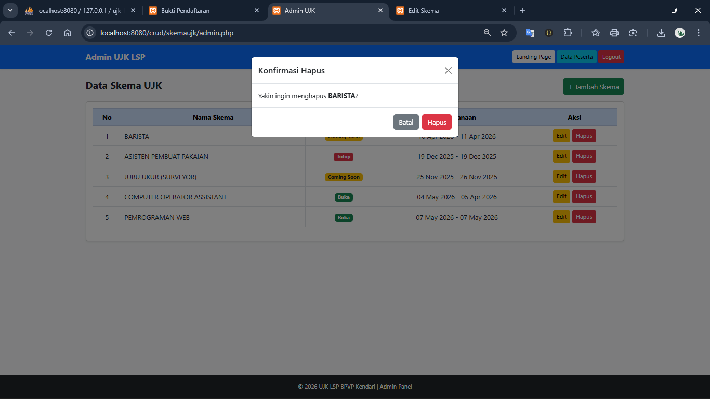

# 📌 Sistem Pendaftaran Peserta Uji Kompetensi

Aplikasi ini merupakan sistem berbasis web yang digunakan untuk melakukan pendaftaran peserta Uji Kompetensi secara online. Sistem ini memudahkan peserta dalam melakukan pendaftaran serta membantu admin dalam mengelola data peserta.

---

## ✨ Fitur Utama

- 📝 Form pendaftaran peserta
- ✅ Halaman konfirmasi setelah pendaftaran berhasil
- 🖨️ Cetak bukti pendaftaran
- 👨‍💼 Halaman login admin
- 📋 Manajemen data peserta
- 🔍 Filter data berdasarkan skema
- ➕ Tambah & edit skema
- ❌ Hapus skema
- 📊 Export data ke Excel

---

## 🛠️ Teknologi yang Digunakan

- PHP
- MySQL
- HTML, CSS, JavaScript

---

## 📷 Tampilan Aplikasi

### 1. Landing Page


Halaman awal aplikasi yang ditampilkan kepada pengguna.

---

### 2. Form Pendaftaran


Form untuk menginput data peserta seperti nama, nomor HP, dan skema.

---

### 3. Berhasil Daftar


Menampilkan notifikasi bahwa pendaftaran berhasil.

---

### 4. Cetak Bukti Pendaftaran


Peserta dapat mencetak bukti pendaftaran.

---

### 5. Login Admin


Halaman login untuk admin.

---

### 6. Halaman Admin


Menampilkan dashboard admin.

---

### 7. Data Peserta


Menampilkan data seluruh peserta yang telah mendaftar.

---

### 8. Filter Peserta


Fitur untuk memfilter data berdasarkan skema.

---

### 9. Tambah & Edit Skema


Digunakan untuk menambah dan mengedit data skema.

---

### 10. Hapus Skema


Fitur untuk menghapus data skema.

---

## 🚀 Cara Menjalankan Aplikasi

1. Clone repository:
   ```bash
   git clone https://github.com/username/nama-repo.git
